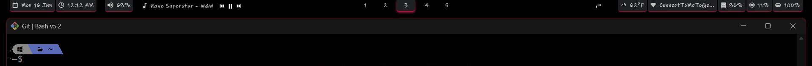
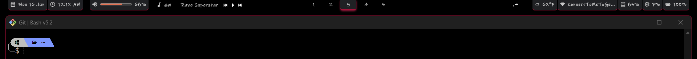

# Mxke Zebar Configuration




<p align="center">
  
  
  
</p>

## Installation

### Prerequisites

- Windows 10/11
- [GlazeWM](https://github.com/glzr-io/glazewm) (for workspace features)
- [Zebar](https://github.com/glzr-io/zebar) 

### Steps

1. **Navigate to Zebar config directory**
   ```bash
   cd %userprofile%/.glzr/zebar
   ```

2. **Clone this repository**
   ```bash
   git clone https://github.com/Mxke-N/mxke-zebar.git
   ```
   
3. **Apply Mxke Zebar**
   - Reload Zebar
   - Open Zebar settings
   - Close other widgets
   - Select the "mxke-zebar" config
   - Choose `mxke-with-glazewm.zebar.json` and apply

4. **Set Mxke Zebar as default**
   - Edit `settings.json` to use the preset at startup:
   ```json
   {
      "$schema": "https://github.com/glzr-io/zebar/raw/v2.4.0/resources/settings-schema.json",
      "startupConfigs": [
         {
            "path": "mxke-zebar\\mxke-with-glazewm.zebar.json",
            "preset": "default"
         }
      ]
   }
   ```

## Features

- **🎵 Media Controls**
  - Volume control with slider
  - Spotify media playback control
  - Toggleable media title auto scroll loop 

- **🖥️ System Information**
  - Memory and CPU usage stats
  - Battery level and charging status
  - Network connection display (WiFi or Ethernet) 

- **☁️ Weather & Time**
  - Local weather conditions with icons
  - Date and time display

- **🧱 Window Management**
  - GlazeWM integration
  - Workspace control features

## Customization

Edit `styles.css` to customize colors, fonts, or layout.

## Contributing

Feel free to submit issues, fork the repository, and create pull requests for any improvements.
